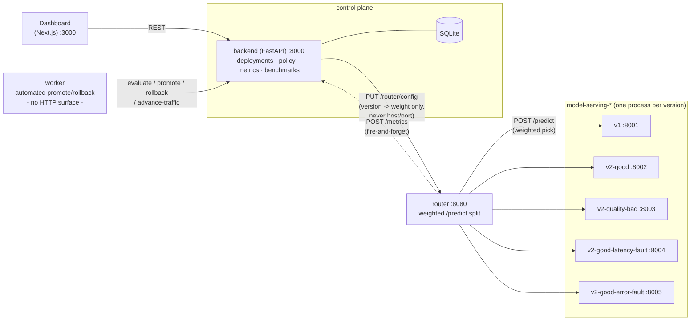

# ModelOps Control Plane

[](https://github.com/negativexq/modelops-control-plane/actions/workflows/ci.yml)

A lightweight ModelOps platform that rolls out new ML model versions via controlled
canary deployments, with policy-based promotion/rollback, a benchmark suite to
exercise the whole loop end to end, and an incident timeline that explains *why*
each decision happened.

Built as a 12-sprint solo project to demonstrate the full loop a real MLOps/
platform team owns - not a wrapper around someone else's inference server, but the
control plane, traffic router, policy engine, and automation that decide when a new
model is safe to receive real traffic. Designed to run comfortably on a 16 GB RAM
machine; heavy components like Kubernetes, MLflow, and Prometheus are deliberately
not part of it - see [Production evolution](#production-evolution) for what would
change if this had to actually run at scale.

## Contents

- [Architecture](#architecture)
- [Quickstart](#quickstart)
- [Demo walkthrough](#demo-walkthrough)
- [Project layout](#project-layout)
- [Components](#components)
- [Development](#development)
- [Resource footprint](#resource-footprint)
- [Known limitations](#known-limitations)
- [Production evolution](#production-evolution)
- [Troubleshooting](#troubleshooting)

## Architecture

| Layer | Tech |
|---|---|
| Backend / control plane | FastAPI + SQLAlchemy + SQLite + Alembic + pytest |
| Frontend / dashboard | Next.js + TypeScript + Tailwind + Recharts |
| Model serving | scikit-learn + joblib, one FastAPI process per model version |
| Load generation | Locust (benchmark suite) |
| Runtime | Docker + Docker Compose |

### Services & ports

| Service | Port | What it is |
|---|---|---|
| `backend` | 8000 | Control plane: deployments, policy, metrics, benchmarks API |
| `frontend` | 3000 | Dashboard (Next.js) |
| `router` | 8080 | Weighted traffic router between stable/canary |
| `model-serving-v1` | 8001 | Stable fraud model |
| `model-serving-v2-good` | 8002 | Healthy canary candidate |
| `model-serving-v2-quality-bad` | 8003 | Deliberately weak model, for the quality-regression scenario |
| `model-serving-v2-good-latency-fault` | 8004 | Same artifact as v2-good, runtime-toggleable latency fault |
| `model-serving-v2-good-error-fault` | 8005 | Same artifact as v2-good, runtime-toggleable error fault |
| `worker` | *(internal only)* | Automated promotion/rollback loop, no HTTP surface |

The control plane is the single source of truth for traffic allocation - the
router's config is just a cache, pushed by the control plane on every change. See
[docs/DESIGN_NOTES.md](docs/DESIGN_NOTES.md) for the reasoning behind this and every
other cross-service boundary in the system.

### How the pieces talk to each other



The router never learns a version's host/port from the control plane - it reads its
own static `ROUTER_VERSION_HOSTS` map. The control plane never talks to a serving
container directly. Neither service can accidentally leak the other's concerns; see
[docs/DESIGN_NOTES.md](docs/DESIGN_NOTES.md) for why that boundary is deliberate.

## Quickstart

```bash
make prepare-models   # synthetic dataset + train v1/v2-good/v2-quality-bad + evaluate
make migrate          # apply Alembic migrations
make dev              # docker compose up --build (all services above)
```

Then check:

- Backend: http://localhost:8000/health
- Frontend: http://localhost:3000
- Router: http://localhost:8080/router/health

## Demo walkthrough

Two parts: first the manual rollout flow a human actually uses, then the automated
FAIL → rollback loop end to end - the thing this whole project is really about.

**Part 1 - a manual canary rollout**

```bash
# 1. Model artifacts already exist from Quickstart (make prepare-models trained
#    v1, v2-good, and v2-quality-bad). Start a canary at 10% traffic:
curl -s -X POST localhost:8000/api/deployments \
  -H 'Idempotency-Key: demo-1' -H 'content-type: application/json' \
  -d '{"model_name":"fraud-model","stable_version":"v1","canary_version":"v2-good","canary_weight":0.1}'
# -> note the "id" field, e.g. DEPLOYMENT_ID=...

# 2. Send it some traffic
curl -s -X POST localhost:8080/router/predict -d '{...}' -H 'content-type: application/json'
#    (see backend/scripts/benchmarks/locustfile.py's _sample_payload for a full,
#    valid request body - every trained version accepts the same superset of fields)

# 3. Watch it in the dashboard: http://localhost:3000/deployments/<DEPLOYMENT_ID>
#    Traffic distribution, Canary analysis, and the Timeline all update from the
#    same API a human or the worker would call - promote/rollback whenever you like.
```

**Part 2 - the automated rollback loop**

The benchmark suite *is* this demo, already wired end to end: it creates its own
isolated canary deployment (`model_name=benchmark-latency-failure`, so it never
touches the deployment from Part 1), injects +400ms of latency into the canary via
`PUT /fault-injection`, generates load, and lets the automated worker take it from
there.

```bash
make benchmark-latency-failure
# or, live: http://localhost:3000/benchmarks -> "Latency Regression" -> Run
```

What happens, in order (all of it visible afterward on that deployment's Timeline):

1. The canary starts receiving traffic with +400ms of injected latency.
2. The worker's next poll cycle calls `/evaluate` - `latency_p95_increase` comes
   back **FAIL** (canary p95 is now far above the stable baseline).
3. Because `FAIL` beats every other check, the worker calls `/rollback` itself
   (`triggered_by=automatic` in the resulting event) - traffic returns to 100%
   stable, no human involved.
4. Open the deployment's page - `GET /api/deployments` lists it (look for
   `is_benchmark: true` and the **Benchmark** badge), then its detail page's
   **Timeline** shows the whole story chronologically: traffic ramping up, the
   FAIL policy evaluation with its plain-English explanation, then the automatic
   rollback event.

This is also exactly what CI's `integration` job exercises on every push - see
[`backend/scripts/ci_smoke_test.py`](backend/scripts/ci_smoke_test.py).

## Project layout

```
backend/
  app/
    control_plane/    deployment lifecycle, traffic allocation, metrics API
    policy/            PASS/FAIL/INCONCLUSIVE evaluation engine
    worker/            automated promotion/rollback loop (separate process)
    router/            weighted traffic router
    serving/           per-version model serving app (+ runtime fault injection)
    benchmarks/        dashboard-triggered benchmark runs API
  scripts/
    benchmarks/        CLI benchmark orchestrator + Locust load definition
    train_models.py, evaluate_models.py, generate_dataset.py
  alembic/             DB migrations
  tests/
frontend/
  src/app/             Next.js pages (Overview, Models, Deployments, Benchmarks)
  src/lib/             typed API client, fetch/mutation hooks, formatting
docs/
  DESIGN_NOTES.md      the "why" behind each design decision
```

## Components

Each ran as its own sprint; the tag is there for history, not because the numbering
matters day to day. Every section links to its deep dive in
[docs/DESIGN_NOTES.md](docs/DESIGN_NOTES.md) for the reasoning behind the choices
below - this file only covers what exists and how to use it.

### Model registry (Sprint 1)

```bash
make prepare-models   # generate-data + train-models + evaluate-models
```

- `GET /api/models`, `GET /api/models/{name}/versions`,
  `GET /api/models/{name}/versions/{version}[/evaluation]`

### Model serving (Sprint 2)

One process per model version (`app.serving.main:app`), selected via
`MODEL_NAME`/`MODEL_VERSION`.

- `GET /health`, `GET /ready`, `POST /predict`
- `GET`/`PUT /fault-injection` — runtime-toggleable `latency_ms`/`error_rate`
  (`403` in production); this is what the benchmark suite uses to simulate a
  regression without restarting a container.

### Traffic router (Sprint 3)

```bash
curl -X POST localhost:8080/router/predict -d '{...}' -H 'content-type: application/json'
```

- `POST /router/predict` — weighted-random pick, forwards the body unmodified,
  tags the response with `routed_to`.
- `GET`/`PUT /router/config` — read/replace `{model_name, targets: [{version, weight}]}`.
- `GET /router/health` — router liveness + each target's live `/ready` status.
- A target that's unhealthy or unreachable returns **503**, never a silent
  fallback to another target ([why](docs/DESIGN_NOTES.md#traffic-router)).

### Control plane & deployment lifecycle (Sprint 4)

```bash
curl -X POST localhost:8000/api/deployments -H 'Idempotency-Key: <uuid>' -d '{...}'
```

- `POST /api/deployments`, `GET /api/deployments[/{id}]`,
  `POST /api/deployments/{id}/promote`, `POST /api/deployments/{id}/rollback`.
- State machine (invalid transitions return 409):

  ```
  PENDING -> DEPLOYING -> CANARY_RUNNING -> EVALUATING -> PROMOTING -> PROMOTED
                                                        -> ROLLING_BACK -> ROLLED_BACK
                                                        -> INCONCLUSIVE -> (promote/rollback)
  any in-flight state -> FAILED
  ```

- Every transition is recorded as a `DeploymentEvent` (the audit trail).

### Metrics (Sprint 5)

- `POST /api/deployments/{id}/metrics` — the router calls this after every forward.
- `GET /api/deployments/{id}/metrics?window_seconds=300` — p50/p95/p99 latency,
  error rate, plus precision/recall/false-positive-rate (`null` until something
  backfills `actual_label` - see [Known limitations](#known-limitations)).
- `GET /api/deployments/{id}/comparison?window_seconds=300` — same, `canary - stable`.

### Dashboard (Sprint 6)

Next.js Client Components calling the control plane directly
(`NEXT_PUBLIC_API_URL`, CORS via `MODELOPS_CORS_ALLOW_ORIGINS`).

- **Overview** (`/`), **Models** (`/models`), **Deployments** (`/deployments`,
  `/deployments/[id]` with Canary Analysis charts), **Benchmarks** (`/benchmarks`).

### Policy engine (Sprint 7)

```bash
curl -X POST localhost:8000/api/deployments/<id>/evaluate
curl localhost:8000/api/deployments/<id>/policy-evaluations
```

- Four checks (`minimum_requests`, `latency_p95_increase`, `max_error_rate`,
  `minimum_recall`), each persisted as its own `PolicyEvaluation` row.
- Overall verdict: **FAIL beats INCONCLUSIVE beats PASS**
  ([why](docs/DESIGN_NOTES.md#policy-engine)).
- Records what the policies found - a human still calls `/promote`/`/rollback`.

### Automated promotion & rollback (Sprint 8)

```bash
docker compose up backend router model-serving-v1 model-serving-v2-good worker
```

`app/worker/` is a separate, stateless process that acts on `/evaluate` results
through the control plane's own REST API - the same endpoints a human would call.

- **PASS** → advance traffic (`10% → 25% → 50% → 100%`) or promote at 100%.
- **FAIL** → rollback.
- **INCONCLUSIVE** → retry up to `max_inconclusive_retries`, then freeze (a human
  can still promote/rollback a frozen deployment).
- `triggered_by=manual|automatic` distinguishes human vs. worker actions in the
  event log.

### Benchmark suite (Sprint 9)

```bash
make benchmark-baseline        # or: benchmark-latency-failure, benchmark-error-failure,
                                #     benchmark-quality-failure, benchmark-success
make benchmark-all             # all five, sequentially
```

Drives five repeatable end-to-end scenarios against a running stack using Locust,
each in its own isolated `model_name`. **Only one benchmark runs at a time** - the
router holds a single active traffic split.

- Two scenarios use the fault-injection containers (`model-serving-v2-good-*-fault`)
  via the runtime `PUT /fault-injection` endpoint, always reset in a `finally`
  block even on crash.
- `quality-failure` and `success` use deliberately loosened thresholds (and, for
  `success`, synthetic ground-truth backfill) to demonstrate the automation paths
  honestly - see [Known limitations](#known-limitations).
- Each run writes `backend/benchmark-results/{scenario}.{json,md}` with
  time-to-detect / time-to-action measurements.

**From the dashboard**: the same five scenarios can be started and watched live
from `/benchmarks` (`POST /api/benchmarks/run`, polls `GET
/api/benchmarks/current`) instead of the CLI - useful for a live demo. `POST /run`
returns **409** while another run is active, and the UI disables every scenario's
button proactively rather than just reacting to that.

### Incident timeline & explainable policy UI (Sprint 10)

Every deployment's `DeploymentEvent` (state transitions, worker actions) and
`PolicyEvaluation` (per-check results) rows, merged into one chronological story.

```bash
curl localhost:8000/api/deployments/<id>/timeline
```

- Each item is tagged `"event"` or `"policy_evaluation"` in the same response,
  sorted oldest-first.
- Every policy item carries a derived, human-readable `explanation` - not just
  `INCONCLUSIVE`, but *why*: "insufficient data" (not enough traffic yet) is
  called out as a distinct reason from "actual_label not available" (no
  ground-truth labels backfilled), and a `minimum_requests` check that's stuck
  because the canary is already at 100% traffic says so explicitly, naming the
  real platform limit instead of leaving a human to guess
  ([why](docs/DESIGN_NOTES.md#policy-engine)).
- `DeploymentOut` also gains a derived `is_benchmark` field (`model_name` prefix,
  no new column) - the dashboard shows a **Benchmark** badge wherever a deployment
  came from the benchmark suite rather than a real rollout, and the manual
  Promote/Rollback buttons show a warning while the deployment is in a status the
  automated worker also acts on.

### Stabilization & documentation (Sprint 11)

No new API surface - this sprint made the platform demoable and trustworthy
instead of adding features: the CI `integration` job (see
[Development](#development)), this README pass (architecture diagram, demo
walkthrough, real measured [resource footprint](#resource-footprint), and the
[troubleshooting](#troubleshooting) log above), and
[docs/DESIGN_NOTES.md's Future vision](docs/DESIGN_NOTES.md#future-vision).

## Development

```bash
make dev             # bring up the whole stack via docker compose
make test            # backend tests (pytest) - 210 tests, ~91% statement coverage
make coverage        # same, plus an HTML report at backend/htmlcov/index.html
make lint            # backend (ruff, mypy) + frontend (eslint, tsc) lint/type-check
make ci-smoke-test   # the same real-stack check CI runs - needs `make dev` running
make down            # stop the services
```

**CI** ([`.github/workflows/ci.yml`](.github/workflows/ci.yml)) runs three jobs on
every push/PR:

| Job | What it checks | Runtime |
|---|---|---|
| `backend` | `ruff`, `mypy --strict`, `pytest` (210 tests, mocked collaborators) | seconds |
| `frontend` | `eslint`, `tsc --noEmit` | seconds |
| `integration` | Builds and boots the **real** 9-container stack (8 HTTP-exposed services + the worker, which has no HTTP surface), then runs [`backend/scripts/ci_smoke_test.py`](backend/scripts/ci_smoke_test.py)'s three scenarios - gated on the two jobs above passing first | a few minutes |

The `integration` job's three scenarios, in order: **(1)** a fast manual create →
evaluate → promote path; **(2)** inject real latency into a canary and wait for the
**actual automated worker** (not a manual call standing in for it) to detect the
resulting policy FAIL and roll back on its own; **(3)** a healthy canary, waiting
for the worker to really walk it through every traffic stage (10% → 25% → 50% →
100%) and promote it. Scenarios 2 and 3 only finish in reasonable CI time because
the worker's poll interval is turned down to 2s for this job specifically
(`WORKER_POLL_INTERVAL_SECONDS` in the workflow file - defaults to 15s for real use
and for local `make dev`, unaffected unless that env var is set).

The `integration` job exists because every real bug found in this project (see
[Troubleshooting](#troubleshooting)) was found by running the actual stack, not by
a unit test with mocked collaborators - unit tests keep that class of regression
from coming back, but they can't catch it in the first place.

## Resource footprint

Measured with `docker stats --no-stream` on the actual target hardware (Apple
Silicon MacBook, native `linux/arm64` containers - no emulation, both `python:3.12-
slim` and `node:22-slim` publish arm64 images, so nothing extra is needed on
Apple Silicon):

| Service | Measured RSS |
|---|---|
| `frontend` (Next.js dev server) | ~1.0 GiB |
| 5× `model-serving-*` | ~165 MiB each (~830 MiB total) |
| `backend` | ~99 MiB |
| `router` | ~66 MiB |
| `worker` | ~32 MiB |
| **All 9 containers together** | **~2.0 GiB** |

That's containers only - Docker Desktop's own Linux VM reserves memory on top of
this regardless of what's running inside it (check Docker Desktop's Resources
settings; the default is usually several GB). Even accounting for that, the whole
stack plus a browser and an editor fits comfortably on a 16 GB machine. The
frontend's ~1 GiB is by far the largest single consumer - that's Next.js's dev
server (Turbopack) with hot-reload watching every source file, not something this
project's code does; `next build && next start` would use meaningfully less but
loses hot reload, which is why `make dev` uses `next dev`.

## Known limitations

There is no real `actual_label` (ground-truth) source anywhere in the platform.
This means:

- The `minimum_recall` policy check is always `INCONCLUSIVE`, never `FAIL`.
- Since `INCONCLUSIVE` beats `PASS`, **no deployment can be automatically promoted**
  past its first traffic stage without some source of labels.
- The `benchmark-success` scenario backfills synthetic `(prediction, actual_label)`
  pairs to still exercise the automatic-promotion path end to end - this is a
  simulated stand-in for a delayed label feed, not real platform behavior, and is
  called out explicitly wherever it applies (the scenario's own report, and its
  card on the dashboard).

Beyond that specific gap, a number of features were deliberately left out of scope
for this project rather than half-built - see [docs/DESIGN_NOTES.md's Future
vision](docs/DESIGN_NOTES.md#future-vision) for what they are and why now wasn't
the time for them (multi-model support, a real inference gateway, cost/drift/data-
quality/availability policies, a model approval workflow, and dev/staging/prod
environment separation).

## Production evolution

This project optimizes for running on one laptop and being easy to read end to
end. If it had to actually run in production, here's what would change first, and
why:

| Today | In production | Why |
|---|---|---|
| SQLite | PostgreSQL | SQLite's writer lock serializes every write across the whole database - fine for one backend process on one machine, but a real deployment runs multiple backend replicas and needs real concurrent writes, proper connection pooling, and point-in-time recovery. |
| One `worker` process | Distributed workers + leader election / row-level locking | A single worker is a single point of failure and a throughput ceiling. Multiple workers competing for the same deployments need real mutual exclusion (e.g. `SELECT ... FOR UPDATE`, or a leader-election library) instead of the single-process assumption baked into today's polling loop. |
| Router `POST`s metrics to the backend directly | Kafka / an event stream | A direct HTTP call from the hot path couples the router's request latency to the control plane's availability and DB write latency, even though it's fire-and-forget today. An event stream decouples producer from consumer, survives a control-plane outage without losing data, and lets more than one consumer (metrics, alerting, a future data-quality pipeline) read the same stream independently. |
| Docker Compose | Kubernetes | Compose has no rolling restarts, no horizontal autoscaling, no built-in service mesh/mTLS, and no multi-node scheduling - fine for one host, not for a platform serving real traffic across a fleet. |
| Local filesystem model registry | Object storage (S3/GCS) + MLflow (or similar) | `backend/artifacts/` is a bind mount on one machine - it doesn't survive that machine dying, isn't versioned beyond a directory name, and can't be read by workers on other hosts. A model registry needs to be a shared, versioned, network-accessible store, and MLflow (or an equivalent) adds experiment tracking and lineage this project never needed for a single demo pipeline. |
| No auth | OIDC + RBAC | Every endpoint here is open on purpose, to keep the demo frictionless. A real control plane needs to know *who* is promoting/rolling back a model (for the audit trail this project already builds - see the Timeline) and *whether they're allowed to* - separate permissions for "can view metrics" vs. "can promote to 100% traffic" at minimum. |

## Troubleshooting

Real problems hit while building this project, not a generic checklist:

- **A deployment's `minimum_requests` check stays `INCONCLUSIVE` forever once the
  canary reaches 100% traffic.** Not a bug: the stable side receives ~0 traffic at
  that point and can never accumulate enough samples to pass. The Timeline's
  explanation for this check names it explicitly ("stable side has not received
  enough traffic... the canary is already at 100%... not a bug") - see [Known
  limitations](#known-limitations) and
  [docs/DESIGN_NOTES.md](docs/DESIGN_NOTES.md#policy-engine).
- **Timestamps read hours off, or elapsed-time counters show huge numbers.**
  SQLite's `DateTime(timezone=True)` isn't actually enforced by the driver - a
  value written as UTC can round-trip as an offset-*naive* string. Anything that
  parses a timestamp from the API (Python or JS) has to explicitly assume UTC when
  no offset is present, rather than trusting the local `datetime`/`Date` parser's
  default. Fixed in both directions: `parse_timestamp` in
  `scripts/benchmarks/report.py` (Python) and `parseApiDate` in
  `frontend/src/lib/format.ts` (JS) - if you add a new place that parses an API
  timestamp, use one of those instead of `datetime.fromisoformat`/`new Date()`
  directly.
- **The worker process dies during a control-plane restart or migration.** A
  transient connection error mid-sweep used to propagate out of `run_once()` and
  crash the whole worker loop. Fixed by wrapping the sweep in try/except inside
  `run_forever()` (`app/worker/loop.py`) - a transient outage gets logged and
  retried next cycle instead of taking the process down; there's nothing in-memory
  to lose since the worker re-derives all state from the control plane every cycle.
- **`make benchmark-*` exits nonzero even though the scenario "worked."** Locust
  exits nonzero by default whenever *any* request fails - which is the expected,
  desired outcome for the `latency-failure`/`error-failure` scenarios (that's the
  whole point of injecting a fault). Fixed with `--exit-code-on-error 0` in
  `scripts/benchmarks/load_runner.py`; the scenario's actual pass/fail comes from
  comparing `observed_outcome` to `expected_outcome`, not Locust's exit code.
- **`git push` rejected with `GH007: Your push would publish a private email
  address`.** GitHub's "keep my email private" setting blocks pushes whose commit
  author/committer email isn't the `@users.noreply.github.com` address - and it
  checks *both* fields, so `git commit --amend --author=...` alone isn't enough;
  the committer identity (drawn from `user.email` at commit time) needs fixing
  too, e.g. `GIT_COMMITTER_EMAIL=<id>+<username>@users.noreply.github.com git
  commit --amend --author="<name> <same address>"`.
- **Almost shipped a circular `depends_on` in `docker-compose.yml`.** The router
  depends on the backend being reachable at startup, and it was tempting to also
  add the reverse (backend depends_on router) when wiring up a feature that needed
  the router - `docker compose config` catches this immediately (nonzero exit),
  worth running after editing the dependency graph.
